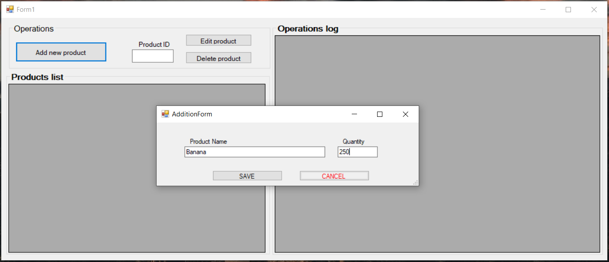
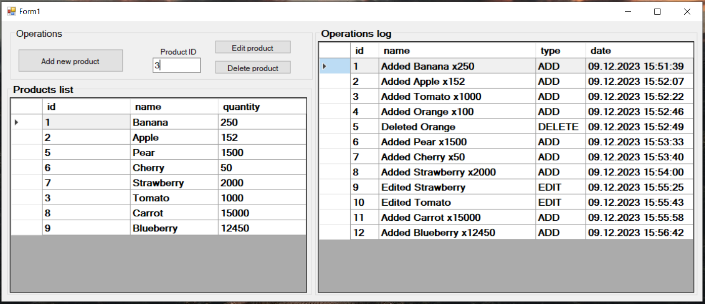
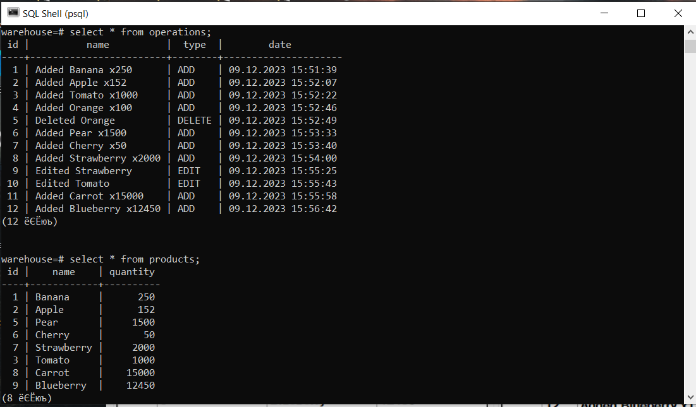

# Warehouse Management Application
## Student: Nazim Mukhtarbekov
## Group: COM20

### Description:
This application is a management system for a warehouse owners.  
### Prerequisites:
- Visual Studio
- PosgreSQL
- .NET framework
- Npgsql
   
### Functionalities:  
- Addition. You can add new products and it will be automatically saved to the database.  
- Editing. You can edit existing products and change their names or quantity.  
- Deletion. You can delete existing products by their ID.   
- Products list. You can see the list of current products in the warehouse.  
- Operations list. You can see the list of operations the were made in the database.  
It will include name of the product, operation type and date of the operation.
 
Here is the screenshots of the app and the database:  

  

  

  
